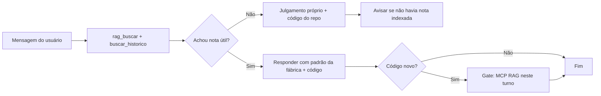
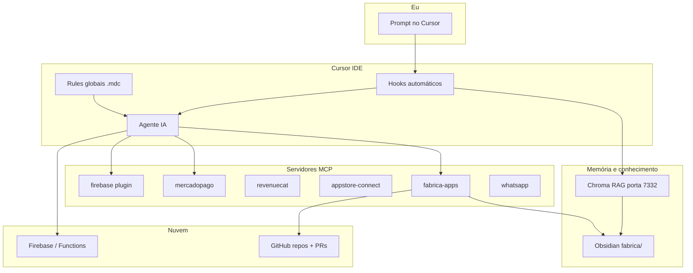
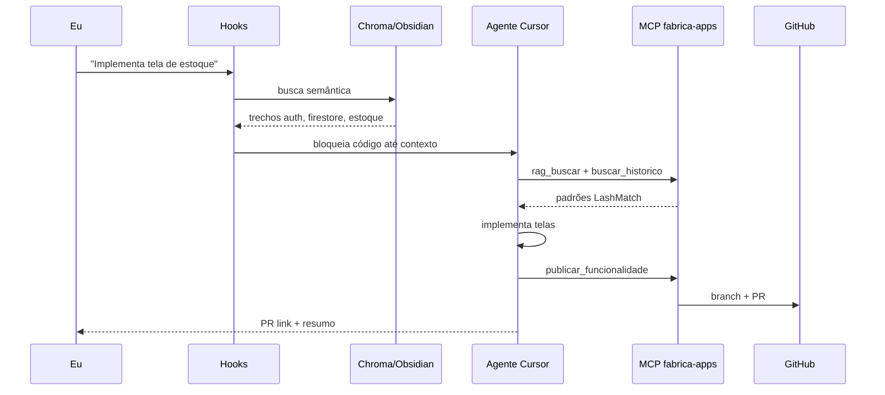

---
tags:
  - fabrica
  - arquitetura
  - ia
  - cursor
  - mcp
  - rag
  - obsidian
atualizado_em: 2026-06-28
autor: Gustavo
status: documentacao-completa
---

# Fábrica de Apps com IA — Arquitetura (como uso hoje)

> **Documento canônico** da fábrica. Agentes Cursor devem consultar via `rag_buscar("arquitetura fabrica")` — não usar `CLAUDE.md` do repo como KB.

> Documento para explicar **como eu uso IA no dia a dia** para criar apps (React Native + Firebase), com memória, padrões e Git automatizado.  
> Projeto de referência: **LashMatch** (app de gestão para salões de cílios).

---

## Em uma frase

Eu não “pergunto pro ChatGPT e copio código”. Montei uma **fábrica**: o Cursor (IDE com IA) consulta **minha base de conhecimento** (Obsidian), segue **regras fixas**, chama **ferramentas** (MCP) para GitHub/Firebase/pagamentos, e **hooks** que impedem a IA de codar no escuro.

---

## Protocolo RAG universal (regra do Gustavo)

**Sempre** consultar RAG **antes de qualquer coisa** — pergunta simples ou complexa.

### Fluxo em todo turno



| Passo | Ferramenta | Quando |
|-------|------------|--------|
| 1 | `rag_buscar` | **Sempre** (exceto oi/obrigado puro) |
| 2 | `buscar_historico` | **Sempre** no mesmo tema |
| 3 | `buscar_solucao` | Só se erro/bug/falha |
| 4 | Ler código | Estado atual do repo |
| 5 | Responder | Priorizar RAG; se vazio, opinião própria |

### Exceções (não consultar RAG)

- Cumprimento puro sem pedido: `oi`, `obrigado`, `valeu`, `ok` — mensagem &lt; 35 caracteres, sem `?`

### Fallback quando RAG não acha nada

- Agente **pode** usar conhecimento geral do modelo
- **Deve** ler o código existente e seguir convenções do projeto
- **Não** deve inventar integração que contradiz decisões em `decisoes.md`
- Mencionar discretamente que não havia nota na fábrica (opcional em respostas triviais)
- Se descobrir padrão novo → `salvar_decisao` + `atualizar_padrao` + reindexar

### O que NÃO substitui MCP

| Situação | Insuficiente | Obrigatório |
|----------|--------------|-------------|
| Hook injetou Chroma no prompt | Só contexto automático | `rag_buscar` + `buscar_historico` antes de **Write/Shell** |
| Pergunta “simples” | Responder direto | Mesmo assim `rag_buscar` |
| `CLAUDE.md` no repo | Ler monólito | Ponte curta; KB = `fabrica/` |

Protocolo detalhado para libs/UI: [[rag-protocolo-antes-de-codar]]

---

## Visão geral (camadas)



| Camada | O que é | Para quê |
|--------|---------|----------|
| **Cursor + Agente** | IDE com chat que edita código | Implementar telas, functions, deploy |
| **Rules** | Regras sempre ativas (`~/.cursor/rules/`) | “Antes de codar, consulte RAG”, fluxos de projeto/feature |
| **Hooks** | Scripts que rodam sozinhos a cada pergunta | Buscar Obsidian, bloquear código até ter contexto |
| **Obsidian** | Notas markdown com padrões e decisões | Fonte da verdade humana (auth, Firebase, WhatsApp…) |
| **RAG (Chroma)** | Busca semântica nas notas | IA acha o padrão certo sem eu colar doc na mão |
| **MCP fabrica-apps** | Servidor Node com ~28 ferramentas | GitHub, RAG, staging, PR, memória de erros |
| **MCPs extras** | Mercado Pago, RevenueCat, App Store Connect, Firebase, WhatsApp | Integrações externas — ver [[mcps-cursor-padrao]] |

---

## Onde ficam os arquivos (mapa mental)

```
C:/Users/gusta/
├── .cursor/
│   ├── mcp.json              ← liga MCPs (fabrica, mercadopago, revenuecat…)
│   ├── rules/                ← regras globais alwaysApply
│   │   ├── rag-memoria-fabrica.mdc      ← RAG universal + gate Write
│   │   ├── firebase-projeto-dinamico.mdc
│   │   ├── firebase-deploy-checklist.mdc
│   │   └── documentacao-automatica-fabrica.mdc
│   └── hooks/
│       ├── hooks.json        ← eventos Cursor (ver tabela abaixo)
│       ├── rag-before-prompt.js   ← Chroma em TODA mensagem (exc. oi puro)
│       ├── rag-pre-tool.js      ← gate Write/Shell até MCP RAG
│       ├── rag-session-start.js
│       ├── rag-lib.js
│       ├── fabrica-health.js
│       ├── fabrica-stop.js
│       ├── firebase-*.js
│       └── hooks-state/rag-pending-<hash>.json
│
├── obsidian/
│   ├── fabrica/              ← 📚 CONHECIMENTO INDEXADO (RAG)
│   │   ├── INDEX.md
│   │   ├── arquitetura-fabrica-ia.md   ← este doc (canônico)
│   │   ├── rag-protocolo-antes-de-codar.md
│   │   ├── padroes-fabrica.md
│   │   ├── lashmatch-web-plataforma.md
│   │   ├── auth-patterns.md
│   │   ├── firebase-setup-patterns.md
│   │   ├── mercadopago-integration.md
│   │   ├── whatsapp-business-api.md
│   │   ├── erros-e-solucoes.md
│   │   └── decisoes.md
│   ├── projetos/
│   │   └── lashmatch-prd.md
│   ├── indexar_rapido.py     ← único que indexa Chroma
│   └── indexar_obsidian_chroma.py --server  ← só HTTP :7332
│
├── fabrica-apps-mcp/
│   └── server-v2.js
│
└── projetos/
    └── LashMatch/
        ├── .cursorrules
        ├── .cursor/rules/    ← regras só deste app
        │   ├── rag-memoria-fabrica.mdc
        │   ├── fonte-verdade-fabrica.mdc
        │   ├── mcps-integracao-obrigatoria.mdc
        │   └── lashmatch-projeto-firebase.mdc
        ├── CLAUDE.md         ← ponte curta (NÃO é KB)
        └── docs/             ← espelho opcional de guias
```

### `hooks.json` — eventos completos

| Evento Cursor | Script | Função |
|---------------|--------|--------|
| `sessionStart` | `fabrica-health.js` | Chroma online? PROJECT.md? |
| `sessionStart` | `firebase-session-start.js` | Contexto Firebase do workspace |
| `sessionStart` | `rag-session-start.js` | Injeta regras RAG universal na sessão |
| `beforeSubmitPrompt` | `rag-before-prompt.js` | Chroma + estado `pending` em **toda** mensagem (exc. cumprimento puro) |
| `preToolUse` | `rag-pre-tool.js` | Read liberado; Write/Shell bloqueado até MCP RAG |
| `beforeShellExecution` | `firebase-shell-gate.js` | Checklist antes de `firebase deploy` |
| `beforeMCPExecution` | `firebase-mcp-gate.js` | Project ID + ambiente Firebase |
| `postToolUse` | `firebase-deploy-post.js` | Pós-deploy: logs, URL web.app |
| `stop` | `fabrica-stop.js` | Código sem sync em `.md` → força checklist |

---

## Memória: Obsidian + RAG

### Obsidian (`fabrica/`)

Eu escrevo (ou a IA documenta depois) coisas que **não quero repetir erro**:

- Padrões de auth, Firestore, Expo Router  
- Integrações (WhatsApp Meta, Mercado Pago)  
- Erros já resolvidos → `erros-e-solucoes.md`  
- Decisões de arquitetura → `decisoes.md`  
- Backlog → `features-pendentes.md`  

### Indexação (RAG)

| Script | Função |
|--------|--------|
| `indexar_rapido.py` | **Único** que indexa o vault no Chroma |
| `indexar_obsidian_chroma.py --server` | HTTP híbrido na porta 7332 (não indexa) |
| `rag_retrieval.py` | Denso + BM25 → RRF → rerank `bge-reranker-v2-m3` |

```powershell
# Depois de conteúdo novo (decisões, erros, padrões) — ORDEM OBRIGATÓRIA:
python C:/Users/gusta/obsidian/indexar_rapido.py
python C:/Users/gusta/obsidian/indexar_obsidian_chroma.py --server

# O MCP fabrica-apps faz isso automaticamente ao chamar:
# registrar_erro_solucao | salvar_decisao | atualizar_padrao
```

O MCP expõe três buscas:

| Ferramenta | Busca em |
|------------|----------|
| `rag_buscar` | Todo vault indexado (semântico) |
| `buscar_historico` | Decisões e padrões anteriores |
| `buscar_solucao` | Erros já resolvidos (+ trecho RAG via `:7332`) |

### Retrieval híbrido (jun/2026)

Pipeline em `rag_retrieval.py`, exposto pelo HTTP `:7332` (MCP `rag_buscar`, `buscar_historico` e parte RAG de `buscar_solucao`):

1. **Denso** — Chroma + `paraphrase-multilingual-MiniLM-L12-v2`
2. **BM25** — `rank_bm25` nos mesmos chunks
3. **RRF** — fusão Reciprocal Rank Fusion (denso com peso 1.5×)
4. **Filtro PRD** — `*-prd.md` excluídos em queries de padrão/fluxo/deploy (`tipo_doc: spec`)
5. **Rerank** — `BAAI/bge-reranker-v2-m3` no top-20; rank 1 preservado do RRF

Metadados de indexação (`indexar_rapido.py`): `tipo_doc` = `padrao` | `spec` | `solucao` | `eval`.  
Pasta `fabrica/eval/` **não** entra no índice (relatórios de eval).

Dependência extra: `pip install rank-bm25`

**Hot path (MCP):** `RAG_RERANK=0` (default) — denso + BM25 + RRF, **sem rerank**.  
Servidor em `http://127.0.0.1:7332` (evitar `localhost` no Windows — delay IPv6 ~2s).  
BM25 pré-construído na subida (`warmup_indices`); alvo **&lt;200 ms** por query (~50 ms medido).

**Eval offline:** `RAG_RERANK=1` opcional para rerank completo.

### Harness de avaliação (baseline RAG)

Golden set + script para medir retrieval **sem alterar** indexação nem ranking.

| Artefato | Função |
|----------|--------|
| `fabrica/eval/golden-set.jsonl` | ~25 pares; campo opcional `aceitaveis` (réguas v2) |
| `fabrica/eval/run_baseline.py` | `--regua v2` baseline · `--tag hybrid` pós-retrieval |
| `fabrica/eval/report-baseline-v2.md` | **Baseline oficial** (réguas justas) |
| `fabrica/eval/report-hybrid.md` | Eval do retrieval híbrido |
| `fabrica/eval/report-delta.md` | Delta híbrido vs v2 |

```powershell
python C:/Users/gusta/obsidian/indexar_obsidian_chroma.py --server
python C:/Users/gusta/obsidian/fabrica/eval/run_baseline.py --regua v2
python C:/Users/gusta/obsidian/fabrica/eval/run_baseline.py --regua v2 --tag hybrid --compare-to fabrica/eval/report-baseline-v2.json
```

**Baseline v2 (denso, jun/2026):** hit@1 48% · hit@3 72% · hit@5 76% · MRR 0.59.  
**Híbrido (jun/2026):** hit@1 56% · hit@3 80% · hit@5 84% · MRR 0.68 — integracao +25pp hit@1; padrao hit@1 flat (40%).

---

## Hooks: o que roda “sozinho”

Antes eu só tinha **regra escrita** (“consulte o RAG”) — a IA ignorava às vezes.  
Agora tenho **hooks** (ganchos) no Cursor + regra **RAG em toda mensagem** (`isTechnicalPrompt` = quase sempre true em `rag-lib.js`).

| Momento | Script | O que faz |
|---------|--------|-----------|
| **Toda mensagem** | `rag-before-prompt.js` | Busca Chroma + salva estado; exceto só cumprimento puro |
| IA vai **ler** código | `rag-pre-tool.js` | **Libera** Read/Grep/Glob |
| IA vai **escrever/deploy** | `rag-pre-tool.js` | **Gate:** bloqueia até MCP `rag_buscar` + `buscar_historico` |
| IA chama **MCP RAG** | `rag-pre-tool.js` | Marca `mcpRagDone` e libera escrita |
| Início da sessão | `fabrica-health.js` | Chroma online? Firebase do workspace? |
| Comando `firebase` | `firebase-shell-gate.js` | Project ID + checklist pré-deploy |
| Depois de `firebase deploy` | `firebase-deploy-post.js` | Próximos passos (logs, web.app) |
| MCP Firebase | `firebase-mcp-gate.js` | `firebase_update_environment` |
| Fim da tarefa | `fabrica-stop.js` | Código sem sync em `.md` → checklist Obsidian |

Detecção automática de intenção (exemplos):

- “criar app / projeto novo” → fluxo `criar_projeto_completo`  
- “nova feature / nova tela” → fluxo `criar_feature` + branch + PR  
- “mercado pago / firebase / whatsapp” → sugere MCP correto + RAG do tema  

---

## MCP fabrica-apps — caixa de ferramentas

Servidor local: `C:/Users/gusta/fabrica-apps-mcp/server-v2.js`  
Configurado em `~/.cursor/mcp.json`.

### Ferramentas (28)

| Grupo | Ferramentas |
|-------|-------------|
| **RAG / memória** | `rag_buscar`, `buscar_historico`, `buscar_solucao`, `analisar_e_aprender`, `salvar_decisao`, `registrar_erro_solucao`, `atualizar_padrao`, `salvar_contexto_conversa`, `listar_decisoes` |
| **GitHub / fluxo** | `criar_projeto_completo`, `criar_feature`, `planejar_feature`, `publicar_funcionalidade`, `criar_branch`, `criar_pr`, `revisar_pr`, `listar_repos_github`, `configurar_projeto_local` |
| **Staging** | `salvar_arquivo_staging`, `listar_staging`, `limpar_staging` |
| **Meta** | `status_fabrica`, `gerar_project_md`, `obter_prompt_agente` |
| **Legado (evitar)** | `ler_secao_claude`, `checar_padrao_lashmatch` → usar `rag_buscar` |

### Projeto novo (greenfield)

```
criar_projeto_completo
  → cria repo no GitHub
  → branch feature/setup-inicial
  → sobe ponte `CLAUDE.md` (curto) + `PROJECT.md` + `.cursorrules` — **KB em `fabrica/` via RAG**
  → .cursor/settings.json (plugin Firebase sem projectId fixo)
  → .cursor/rules/{slug}-projeto.mdc (Firebase dinâmico + negócio)
  → abre Pull Request
  → git clone em C:/Users/gusta/projetos   ← automático
  → scaffold local + checkout feature/setup-inicial
```

Depois: abro a pasta no Cursor e peço telas (`obter_prompt_agente` ux → firebase → frontend → qa).

### Feature nova (app existente)

```
planejar_feature / criar_feature
  → RAG + plano de arquivos
  → código (staging ou repo local)
  → publicar_funcionalidade
       → branch feature/nome
       → commit arquivos no GitHub
       → abre PR
  → revisar_pr (QA automático)
  → salvar_decisao no Obsidian
```

### Memória contínua

| Ferramenta | Quando |
|------------|--------|
| `registrar_erro_solucao` | Depois de corrigir um bug |
| `salvar_decisao` | Decisão técnica importante |
| `atualizar_padrao` | Atualizar `.md` de padrão |
| `salvar_contexto_conversa` | Feature grande concluída |

---

## MCPs especializados (por tema)

| Tema | MCP | Exemplo no LashMatch |
|------|-----|----------------------|
| GitHub + RAG + fluxo | **fabrica-apps** | Tudo |
| Pagamentos Android | **mercadopago** | Assinatura preapproval |
| Assinatura iOS | **revenuecat** + **appstore-connect** | IAP StoreKit |
| Firebase | **plugin Firebase** | Deploy hosting, functions, rules |
| WhatsApp | **whatsapp_lash_match** (LashMatch) | Templates Meta, envio |

A IA chama MCP do tema **e** `rag_buscar` + `buscar_historico` — ver [[mcps-cursor-padrao]].

---

## Regras Cursor (`.mdc`)

### Globais (`~/.cursor/rules/`)

| Arquivo | Função |
|---------|--------|
| `rag-memoria-fabrica.mdc` | RAG universal + gate Write + sync Obsidian |
| `firebase-projeto-dinamico.mdc` | Project ID via `.firebaserc` |
| `firebase-deploy-checklist.mdc` | Checklist deploy |
| `documentacao-automatica-fabrica.mdc` | Doc automática após módulo novo |

### Por projeto (ex.: LashMatch `.cursor/rules/`)

| Arquivo | Função |
|---------|--------|
| `fonte-verdade-fabrica.mdc` | Proíbe CLAUDE.md como KB; RAG primeiro |
| `rag-memoria-fabrica.mdc` | Sync repo ↔ Obsidian LashMatch |
| `mcps-integracao-obrigatoria.mdc` | WhatsApp / RC / MP por tema |
| `lashmatch-projeto-firebase.mdc` | Secrets e projeto Firebase |

### `CLAUDE.md` no repositório

- **Ponte curta** (~50 linhas) — Cursor injeta automaticamente
- **Não** é base de conhecimento
- Monólito histórico: `docs/archive/CLAUDE-monolito-historico.md` (não indexar)

---

## Exemplo real: LashMatch

App React Native (Expo 54) + Firebase para lash designers.

```
LashMatch/
├── app/                 ← telas (Expo Router)
├── functions/SRC/       ← Cloud Functions (IA, WhatsApp, MP…)
├── utils/firebaseConfig.ts
├── docs/                ← cópias de guias (ex: whatsapp-business-api.md)
├── .cursorrules         ← regras do projeto
└── PROJECT.md           ← contexto do app
```

Integrações em produção:

- Auth Google + email  
- Firestore multi-tenant (`artifacts/{appId}/users/{uid}/…`)  
- WhatsApp Business API (templates Meta)  
- Mercado Pago (assinatura)  
- Agendamento público (Firebase Hosting web)  

Tudo isso tem doc no Obsidian `fabrica/` indexada no RAG.

---

## Fluxo que eu conto pros amigos (história)

1. **Ideia** — “Quero um app de salão de cílios com agenda e WhatsApp.”  
2. **Fábrica cria repo** — GitHub + PR + clone local automático.  
3. **IA consulta meus padrões** — hooks puxam Obsidian antes de codar.  
4. **Telas e backend** — agente gera seguindo **RAG** (`fabrica/padroes-fabrica.md`, notas por tema) + cores + Firebase path padrão.  
5. **Feature nova** — branch + PR no GitHub sem eu lembrar comando git.  
6. **Erro** — busca se já resolvemos; registra solução para nunca repetir.  
7. **Deploy** — Firebase hosting/functions; MP webhook; WhatsApp scheduler.  

Eu reviso PR, testo no celular (Expo Go) e aprovo merge — **não é zero humano**, mas o repetitivo (padrão, doc, branch, memória) ficou sistematizado.

---

## O que a IA faz vs o que eu faço

| IA / Automação | Eu |
|----------------|-----|
| Buscar padrões no Obsidian | Defino regras de negócio e design |
| Gerar código inicial e refactors | Testar no device, UX fino |
| Criar repo, branch, PR | Aprovar merge no GitHub |
| Documentar erro/decisão | Validar se doc está correta |
| Sugerir integração (MP, Firebase) | Credenciais, contas, Meta Business |

---

## Pré-requisitos na máquina

- **Cursor** (com MCP habilitado)  
- **Node.js** (MCP + hooks)  
- **Python** + Chroma (`indexar_rapido.py` + `indexar_obsidian_chroma.py --server`)  
- **Obsidian** (opcional para editar notas; RAG lê os `.md`)  
- **Git** + **GitHub token** no MCP  
- **Firebase CLI** + contas (Blaze para functions externas)  
- Servidor Chroma rodando durante dev: porta **7332**  

---

## Comandos que uso todo dia

```powershell
# RAG ligado (servidor — não indexa)
python C:/Users/gusta/obsidian/indexar_obsidian_chroma.py --server

# Reindexar após editar Obsidian (somente este script indexa)
python C:/Users/gusta/obsidian/indexar_rapido.py

# App (exemplo LashMatch)
cd C:/Users/gusta/LashMatch
npx expo start

# Deploy web
npx expo export --platform web
firebase deploy --only hosting
```

---

## Diagrama: pergunta técnica → resposta



---

---

## Falhas comuns e como a fábrica evita

| Falha | Causa | Mitigação |
|-------|--------|-----------|
| Deploy no Firebase errado | MCP global apontava outro repo | Hook `firebase-lib` + `.firebaserc` + `firebase_update_environment` |
| IA codava sem contexto | Só regra escrita, ignorada | Gate em Write/Shell; Read liberado para explorar |
| Loop infinito de bloqueio | Chroma offline + Read bloqueado | Read liberado; se Chroma OK, libera escrita com contexto |
| Código só no staging MCP | `publicar_funcionalidade` falhou | Preferir repo local + git; staging = preview, não fonte única |
| Memória misturada entre apps | Um `rag-pending.json` global | Estado RAG **por workspace** (hash da pasta) |
| Esqueceu de documentar fix | Sem checklist no fim | Hook `stop` → lembrar MCP memória |
| RAG desatualizado | Editou Obsidian sem indexar | `indexar_rapido.py` após `atualizar_padrao` / decisões |
| Pergunta simples sem RAG | `isTechnicalPrompt` antigo filtrava demais | Corrigido: RAG em quase toda mensagem |
| Agente só usa memória do modelo | Não chamou MCP | Regra universal + gate Write |

**Healthcheck diário:**

```powershell
python C:/Users/gusta/obsidian/indexar_obsidian_chroma.py --server
python C:/Users/gusta/obsidian/indexar_rapido.py   # se editou Obsidian
```

**Testar RAG:**

```text
MCP rag_buscar("arquitetura fabrica rag universal")
MCP status_fabrica
python C:/Users/gusta/obsidian/fabrica/eval/run_baseline.py
```

---

## Evolução (o que mudou recentemente)

| Antes | Agora |
|-------|-------|
| Só `.cursorrules` (IA ignorava) | Rules + **Hooks** que bloqueiam |
| Z-API WhatsApp | **WhatsApp Business API (Meta)** |
| Clone manual após criar repo | **`git clone` automático** em `projetos/` |
| MCP só fabrica | Roteamento para **MP / Firebase** por tema |
| Duas rules RAG duplicadas | Uma rule global `rag-memoria-fabrica.mdc` |
| Gate bloqueava Read | Gate v2: Read livre; Write exige RAG |
| Firebase manual por app | Detecção dinâmica `.firebaserc` + hooks |
| Estado RAG único | Estado **por workspace** |
| Projeto novo sem .cursor/ | `criar_projeto_completo` gera rules + settings + clone local |
| Deploy sem validar | Hook pos-deploy + regra `firebase-deploy-checklist.mdc` |
| CLAUDE.md monólito no contexto | Substituído por ponte + KB só em `fabrica/` |
| RAG só em “pergunta técnica” | **RAG universal** em toda mensagem (jun/2026) |

---

## Links internos

- [[rag-protocolo-antes-de-codar]] — protocolo antes de codar libs/UI  
- [[padroes-fabrica]] — padrões gerais  
- [[mcps-cursor-padrao]] — qual MCP por tema  
- [[INDEX]] — índice da base  
- [[../projetos/lashmatch-prd]] — PRD LashMatch  
- [[lashmatch-web-plataforma]] — web sem análise/checkout in-app  
- [[whatsapp-business-api]] · [[mercadopago-integration]] · [[firebase-setup-patterns]]  

## Checklist — documentação 100% operacional

- [x] Protocolo RAG universal + fallback documentado  
- [x] Mapa de arquivos (`~/.cursor`, Obsidian, projeto)  
- [x] `hooks.json` completo  
- [x] Regras `.mdc` globais e LashMatch  
- [x] Lista MCP fabrica-apps (28 tools)  
- [x] CLAUDE.md = ponte, não KB  
- [x] Indexação: `indexar_rapido.py` vs `--server`  
- [x] Falhas comuns + healthcheck  
- [x] Links para notas por tema  

---

## Frase para pitch (30 segundos)

> “Montei uma fábrica de apps: o Cursor consulta meu Obsidian antes de codar, cria repositório e PR sozinho, lembra dos erros que já corrigi, e segue o mesmo stack Expo + Firebase em todo projeto. Eu foco em produto e teste; a IA foca em padrão, memória e Git.”

---

*Última atualização: junho/2026 · Autor: Gustavo*
